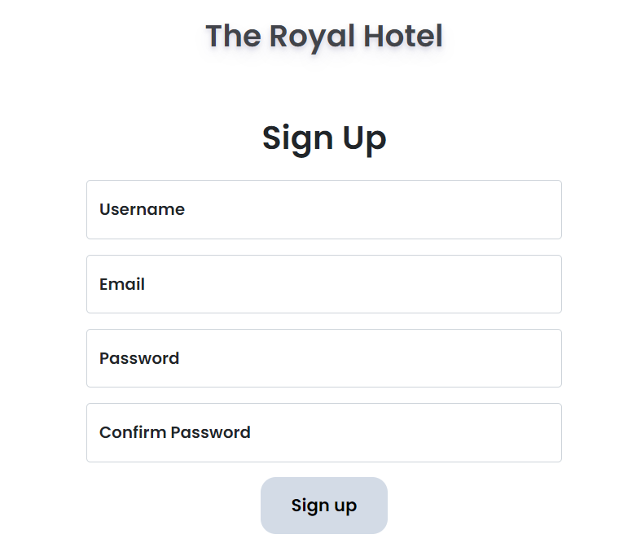

# Hotel reservation application
Application for the reserving hotel rooms using PHP, JS, CSS

# How to make code work:

- Installer php;
- Installer XAMP et lancer APACHE et SQL
- Utiliser le fichier royalhotel.db pour créer la base de données

## L'application:

Le site web est utilisé  pour faire des réservations dans un hotel.

## Main Components:

The files can be described as follows.
- `index.php` for the login page.
- `home.php` creates the front-end of the reservation application.
- `config.php` to create the database connection.
- `admin.php` for the administrator tasks

### Walkthrough

In this section we will demonstrate how the application works:

#### Login page

-  Here is the login page when we first start the application.

  
  

## Client side

-  If it is your first time using the app, you can sign up by providing the info below:

  

  
  
  

- After successfully signing up/ logging, you will be greeted by the welcome page:

  

  
  
  

  
- Here you can choose the type of room you wish to book based on the services offered:

   

  
  
  

### Services offered: 

 

  
  
  

- Information required to reserve a room:

   

  
  
  

- Once the reservation has been completed, you will receive a notification like below:

   

  
  
  

  

  

#### DRAW

  

<b>When there is a DRAW!</b> 

### Quantitative

In this section we show the quantitative results of our experiment. 

  

<b>We can see above how the game looks like while playing.</b>

  

<b>As the players win, their respective score is incremented.</b>

