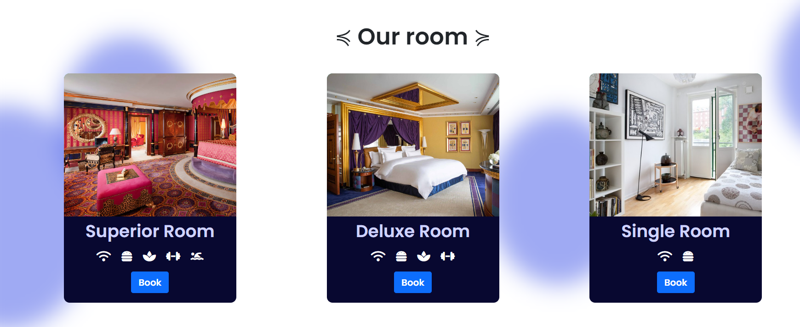

# Hotel reservation application
Application for the reserving hotel rooms using PHP, JS, CSS

# How to make code work:

- Installer php;
- Installer XAMP et lancer APACHE et SQL
- Utiliser le fichier royalhotel.db pour créer la base de données
- Login admin: Admin@gmail.com password: 1234

## L'application:

Le site web est utilisé  pour faire des réservations dans un hotel.

## Main Components:

The files can be described as follows.
- `index.php` for the login page.
- `home.php` creates the front-end of the reservation application.
- `config.php` to create the database connection.
- `admin.php` for the administrator tasks

### Walkthrough

In this section we will demonstrate how the application works:

#### Login page

-  Here is the login page when we first start the application.
-  User can either choose <b>User-side</b> or <b>Staff side</b>.

  
  

## Client side

-  If it is your first time using the app, you can sign up by providing the info below:

  

  
  
  

- After successfully signing up/ logging, you will be greeted by the welcome page:

  

  
  
  

  
- Here you can choose the type of room you wish to book based on the services offered:

   

  
  
  

### Services offered: 

 

  
  
  

- Information required to reserve a room:

   

  
  
  

- Once the reservation has been completed, you will receive a notification like below:

   

  
  
  

  

  

## Administrator side

- Below is the dashboard that the admin can use to obtain information.
  
1. Dashboard
2. Room booking
3. Staff
  

  

- The room booking section where the reservation made by clients will be stored:

  

- The admin can either confirm or delete a reservation:
  

  

  

- The current staffs that are working for Royal Hotel:
- The admin can add also new staff members based on their occupation:
  1. Manager
  2. Cook
  3. Helper
  4. Cleaner
  5. Waiter
     

  

## Conclusion

This document provides an overview of how the application functions, the main programs involved and the credentials to access administrator privilege. Feel free to use the application. :)

